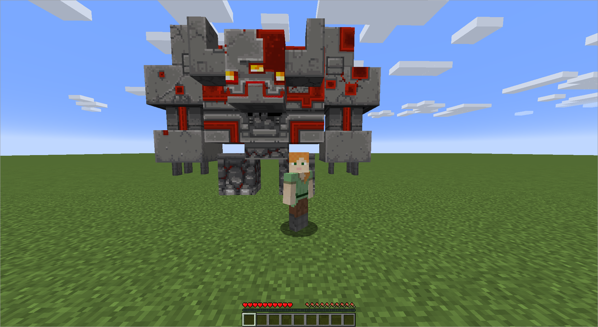

# hephaestus-engine

[](license.txt)
[](https://discord.gg/xbba2fy)

Render and animate models in a Minecraft server by using generated resource packs and client-side entities.
Can use [Blockbench](https://blockbench.net) format and run on Bukkit and [Minestom](https://minestom.net)

### Features
- Automatic resource-pack generation
- Animations
- Blockbench support (Models, animations)

Example:


### Limitations
The normal limitations when creating a java Minecraft model
- Cube rotations are limited by increments of 22.5 from -45 to 45 *(This limitation does not apply for bones)*
- Bones cannot be larger than 48x48x48

### Installation
*(Currently not available from our repositories)*
- Latest Snapshot: [](https://repo.unnamed.team/repository/unnamed-snapshots)
- Latest Release: [](https://repo.unnamed.team/repository/unnamed-snapshots)

### Building
Execute the following commands to build and install the project to your
local Maven repository
```shell
$ git clone https://github.com/unnamed/hephaestus-engine
$ cd hephaestus-engine
$ ./gradlew publishToMavenLocal
```

### Installation
<details>
<summary>Gradle (recommended)</summary>

Add our repository to your `repositories` section
```groovy
repositories {
    maven { url 'https://repo.unnamed.team/repository/unnamed-public/' }
}
```

Add dependency to your `dependencies` section
```groovy
dependencies {
    implementation 'team.unnamed:hephaestus-api:VERSION'
}
```
</details>

<details>
<summary>Maven</summary>

Add our repository to your  `<repositories>`  tag (`pom.xml`)
```XML
<repository>
  <id>unnamed-public</id>
  <url>https://repo.unnamed.team/repository/unnamed-public/</url>
</repository>
```
Add dependency to your  `<dependencies>`  tag (`pom.xml`)
```XML
<dependency>
  <groupId>team.unnamed</groupId>
  <artifactId>hephaestus-api</artifactId>
  <version>VERSION</version>
</dependency>
```
</details>